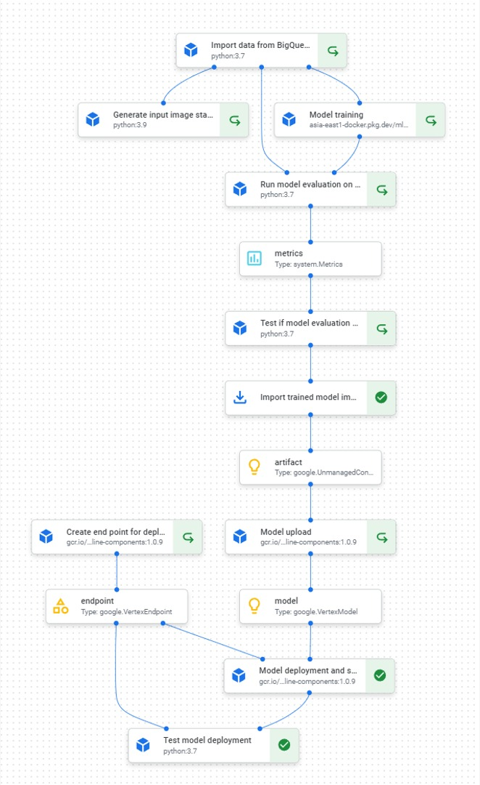

airbus-ship-detection
==============================

This is the git repo for CS611 ML Engineering project for airbus ship detection.

### Group 14 Members:
- Wong Songhan
- Koh Enyong
- Arnold Ng
- Gabriel Quek

## Problem Statement
In this project, we tackle the problem of identifying ships in satellite images. We recognize 3 main applications for this problem:
1.	Maritime Traffic Management – Improves general situational awareness, especially for small vessels not covered by AIS
2.	Maritime Surveillance & Policing – For detection and tracking of vessels with AIS turned off, which may be engaged in illegal activity
3.	Naval Warfare – An additional source of intelligence for detecting enemy locations

## Dataset
The dataset was retrieved from Kaggle based on the Attributes of the dataset:
* 192,556 images from Airbus Ship Detection Challenge
* Each image may have multiple ships
* Labels are run-length encoded (RLE), for data compression, need to be converted to single channel image

Visit this Kaggle page for more info
* https://www.kaggle.com/c/airbus-ship-detection

## Pipeline
Below are the components of our entirepipeline:
1. EDA / Experimentation
2. Data Ingest
3. Model Training
4. Model Evaluation
5. Pipeline Deployment
6. Model Deployment
7. CI/CD
8. Model Monitoring

### 1. EDA / Experimentation
We interactively approach the model building and exploration based on the input dataset. Understanding the dataset and problem well before training and building of our model and their respective components.

### 2. Data Ingest
Due to the complexity of the input dataset and problem itself, preprocessing of the input data is essential to provide good input data for our pipeline.

### 3. Data Statistics Generation
In this section, we create a component that computes the data statistics.

### 4. Model Training
Building of model training component that is used by the overall pipeline to be deployed and part of the CI/CD process that retrains the model based on certain triggers.

### 5. Model Evaluation
Component building of evaluation. Evaluation of the output trained model is conducted. Metrics will be output.

### 6. Model Deployment
Model is deployed to Vertex AI that is used to serve endpoint.

### 7. Pipeline Deployment
Stringing together of the pipeline, alongside test components that ensures every component in the pipeline is in order before pushing it to the Vertex AI platform.

### 9. Model Serving
This notebook provides a demo of calling RESTful api from Endpoint which returns a model prediction result given an input image.

### Overall Pipeline (deployed on Vertex AI)

## Project Organization
------------

    ├── LICENSE
    ├── README.md          <- The top-level README
    ├── 
    ├── saved_models       <- Trained and serialized 
    ├── models
    │
    ├── references         <- Data dictionaries, manuals, and all other explanatory materials.
    │
    ├── reports            <- Generated analysis as HTML, PDF, LaTeX, etc.
    │   └── figures        <- Generated graphics and figures to be used in reporting
    │
    ├── src                <- Source code for use in this project.
    │   ├── __init__.py    <- Makes src a Python module
    │   │
    │   ├── data           <- Scripts to download or generate data
    │   │   └── make_dataset.py
    │   │
    │   ├── features       <- Scripts to turn raw data into features for modeling
    │   │   └── build_features.py
    │   │
    │   ├── models         <- Scripts to train models and then use trained models to make
    │   │   │                 predictions
    │   │   ├── predict_model.py
    │   │   └── train_model.py
    │   │
    │   └── visualization  <- Scripts to create exploratory and results oriented visualizations
    │       └── visualize.py
    │
    └── tox.ini            <- tox file with settings for running tox; see tox.readthedocs.io

--------

<small>Project based on the <a target="_blank" href="https://drivendata.github.io/cookiecutter-data-science/">cookiecutter data science project template</a>. #cookiecutterdatascience</small>

